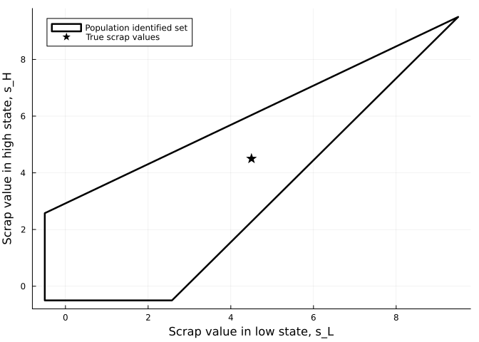
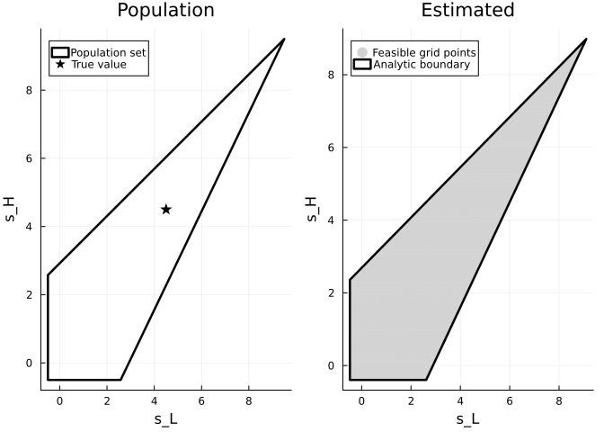
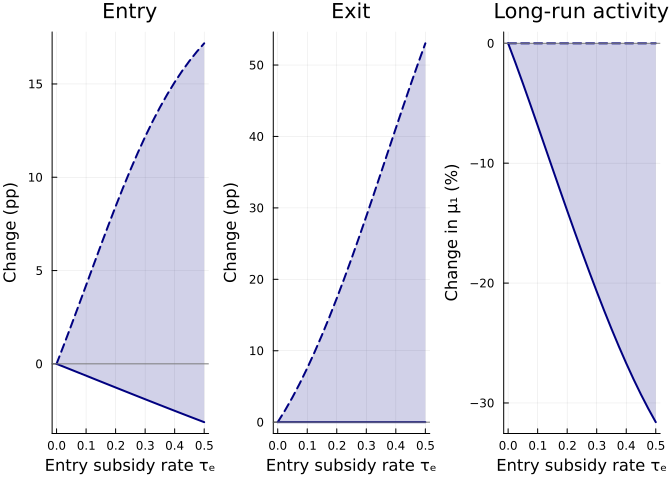
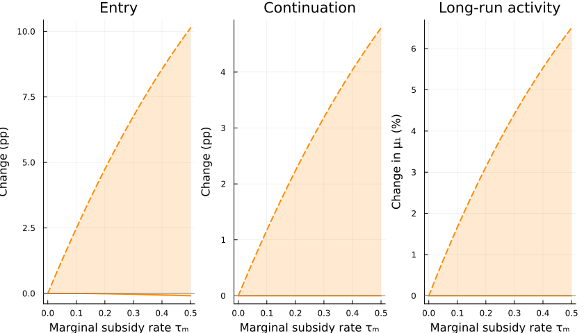
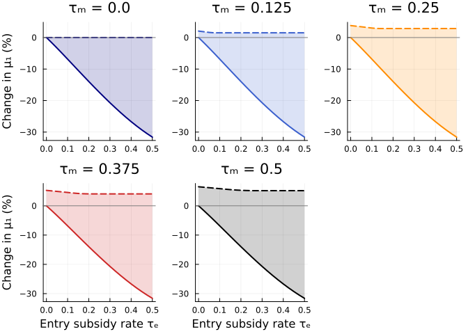
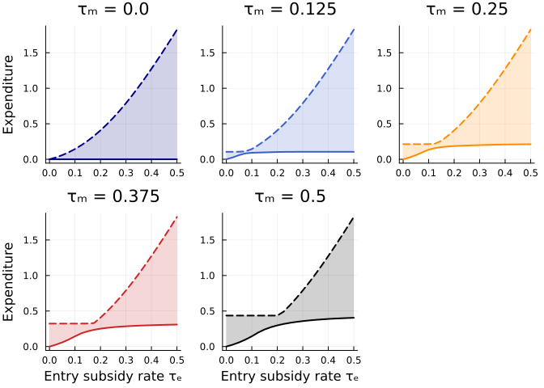
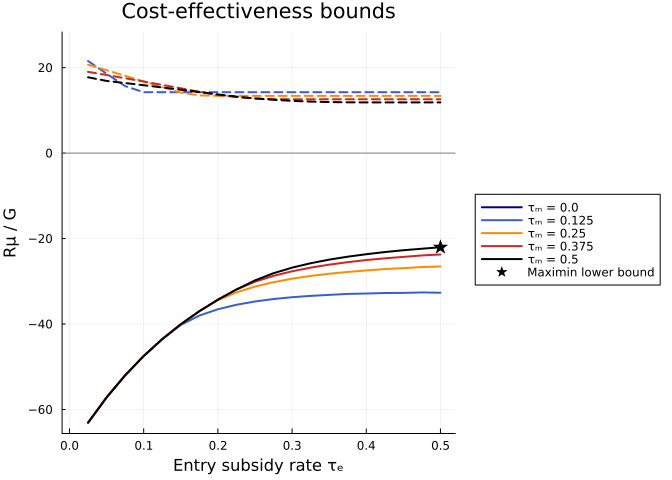

## Idea of the paper

- Kalouptsidi, Kitamura, Lima, and Souza-Rodrigues (2026), “Counterfactual Analysis for Structural Dynamic Discrete Choice Models,” *Review of Economic Studies*.
- Discrete choice data only identifies differences in utilities.
- The primitive parameters and counterfactuals can't be point-identified, in general.
- How much can we learn about conterfactual outcomes from set-identified model?

## Goals

  - Validate replication code for the paper's dynamic discrete-choice model and partial-identification procedure.
  - Visualize the trade-off between entry-cost and marginal-cost subsidies under partial identification.

## What I did

- Let AI read the paper.
- Ask AI to explain the methodology using a minimal example to check their understanding.
  - The paper is clear, so AI understood well. But some explanation was hard to follow, so I checked AI's understanding from several aspects.
- Discuss the detail of toy-model and let AI write the code.
    - This reuired several rounds of back-and-forth communicatio.
    - Ended up just using the paper's example.
- Discuss visualization of counterfactuals.
  - AI is bad at visualization.

# Model

## A four-state model isolates entry and exit

- Replicate a dynamic discrete-choice model with payoff parameters that are not point identified.
- Carry the estimated payoff set into policy counterfactuals.
- A firm chooses $a_t\in\{0,1\}$ in state $x_t=(k_t,w_t)$.
  - $k_t=a_{t-1}$ records the previous action.
  - $w_t\in\{L,H\}$ is the observed profit state.
- The profit state follows the known transition matrix $P$.
- The next lagged-action state is $k_{t+1}=a_t$.

## Flow payoffs create entry and exit margins

| Previous action | Inactive, $a_t=0$ | Active, $a_t=1$ |
|---|---:|---:|
| $k_t=0$ | $0$ | $\pi_w-r_w-e_w$ |
| $k_t=1$ | $s_w$ | $\pi_w-r_w$ |

- $e_w$: entry cost
- $r_w$: running cost
- $s_w$: scrap value received upon exit

## Value iteration delivers the CCPs

The choice-specific values are

$$
v_a(k,w)=u(k,w,a)+\beta E[V(a,w')\mid w].
$$

Type-I extreme-value shocks imply

$$
V(k,w)=\log\bigl[\exp\{v_0(k,w)\}+\exp\{v_1(k,w)\}\bigr],
$$

$$
p_{kw}=\frac{\exp(v_1(k,w))}
{\exp(v_0(k,w))+\exp(v_1(k,w))}.
$$

# Identification

## Observed choices do not reveal one payoff vector

- The data identify four CCPs, $p_{kw}=\Pr(a=1\mid k,w)$, and the transition matrix $P$.
- Logit inversion converts each CCP into a value difference:

$$
d_{kw}=\log\left[\frac{p_{kw}}{1-p_{kw}}\right]
=v_1(k,w)-v_0(k,w).
$$

- The value differences restrict payoffs, but they do not separately determine every $s_w$, $e_w$, and $r_w$.

## The first restriction removes continuation values

For a fixed profit state, both equations contain the same continuation term $C_w$:

$$
d_{0w}=\pi_w-r_w-e_w+C_w,
$$

$$
d_{1w}=\pi_w-r_w-s_w+C_w.
$$

Subtracting the equations gives

$$
d_{1w}-d_{0w}=e_w-s_w.
$$

- The CCPs identify entry cost relative to scrap value, not their separate levels.

## Inactive paths identify the value-function gap

- If the firm chooses $a=0$, both lagged-action states move to $k'=0$ next period.
- Their continuation values therefore cancel when the two inactive paths are compared.
- The logit inclusive-value identity gives

$$
V(1,w)-V(0,w)
=s_w+\log\left[\frac{1-p_{0w}}{1-p_{1w}}\right]
=s_w+A_w(p).
$$

- This value gap recovers the continuation term that appears in the first pair of equations.

## A candidate scrap value determines the other costs

For any candidate $s=(s_L,s_H)$, the two restrictions imply

$$
e_w(s;p)=s_w+d_{1w}-d_{0w},
$$

$$
r_w(s;p)=\pi_w-e_w(s;p)-d_{0w}
+\beta\sum_{w'}P_{ww'}[s_{w'}+A_{w'}(p)].
$$

- Once $s$ is selected, the data determine $e(s;p)$ and $r(s;p)$.
- The restrictions $e_w(s;p)\geq0$ and $r_w(s;p)\geq0$ select a polygon of admissible scrap values.

## Identification delivers a polygon, not a point

{width=62% fig-align="center"}

# Estimation

## Estimation mirrors the population argument

1. Simulate actions and profit transitions.
2. Estimate the four CCPs and the profit transition matrix.
3. Replace $(p,P)$ with $(\widehat p,\widehat P)$ in the payoff restrictions.
4. Construct the estimated polygon in $(s_L,s_H)$.

The sample objective stacks the four restrictions:

$$
\widehat Q(\theta)=\widehat m(\theta)'\widehat m(\theta).
$$

## The simulated data recover the four CCPs



Estimated and population CCPs:



## The estimated object is also a polygon

{width=65% fig-align="center"}

# Counterfactual Analysis

## Policy changes costs, not the baseline environment

- The policy grid uses $\tau_E,\tau_M\in[0,0.5]$.
- An entry subsidy lowers the cost paid when an inactive firm enters:

$$
e_w^{cf}=(1-\tau_E)e_w.
$$

- A marginal-cost subsidy lowers running cost whenever the firm operates:

$$
r_w^{cf}=(1-\tau_M)r_w.
$$

- The exercise holds $\pi$, $\beta$, $P$, and the shock distribution fixed.

## Each policy requires a new dynamic solution

For each $\theta\in\widehat\Theta_I$ and each $(\tau_E,\tau_M)$:

1. Apply the subsidies to flow payoffs.
2. Solve the Bellman equation for $p_{kw}^{cf}$.
3. Combine $p_{kw}^{cf}$ with $P$ to construct $T^{cf}$.
4. Solve $\mu^{cf}=\mu^{cf}T^{cf}$ for the stationary distribution.

The implied long-run active share is

$$
\mu_1^{cf}=\sum_{k,w}\mu_{kw}^{cf}p_{kw}^{cf}.
$$

## Outcomes compare activity, spending, and efficiency

The activity effect is the percentage change from the same model's baseline:

$$
R_\mu=100\frac{\mu_1^{cf}-\mu_1^0}{\mu_1^0}.
$$

Long-run entry and operating expenditures are

$$
G_E=\sum_w \tau_Ee_w\mu_{0w}^{cf}p_{0w}^{cf},
$$

$$
G_M=\sum_{k,w}\tau_Mr_w\mu_{kw}^{cf}p_{kw}^{cf}.
$$

Cost-effectiveness is $CE=R_\mu/(G_E+G_M)$ when expenditure is positive.

## Policy outcomes remain set identified

All payoff vectors in $\widehat\Theta_I$ match baseline behavior, but they can imply different policy responses. For any outcome $Y$, define

$$
\mathcal C_Y(\tau_E,\tau_M)
=\{Y(\theta,\tau_E,\tau_M):\theta\in\widehat\Theta_I\}.
$$

- $Y_L$ is the smallest element of $\mathcal C_Y$; $Y_U$ is the largest.
- The figures report these bounds, not a single selected parameter vector.

## Entry support can raise exit

{width=65% fig-align="center"}

## Operating support raises continuation

{width=62% fig-align="center"}

## Mixed policies produce set-valued activity effects

{width=65% fig-align="center"}

## Expenditure depends on policy timing

{width=65% fig-align="center"}

## Cost-effectiveness is itself partially identified

{width=64% fig-align="center"}

## The identified set changes policy conclusions

- Baseline CCPs determine a payoff set rather than one structural model.
- Every counterfactual therefore re-solves all admissible models.
- Entry support can raise both entry and exit, so long-run activity may fall.
- Marginal-cost support raises continuation but requires recurring payments.
- Policy comparisons must report both expenditure and outcome bounds.
