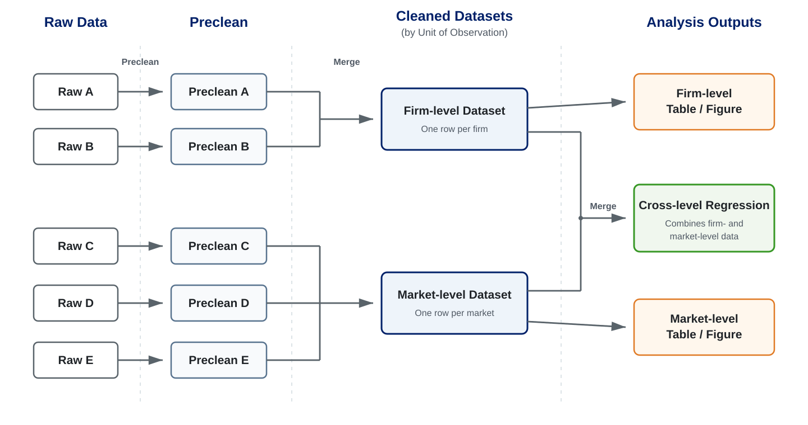

## Motivation and Learning Goals

::: {.callout-important title="Motivation" appearance="simple"}
- We want to turn raw data into analysis-ready data quickly and reproductively.
- We want to give AI specific instructions to clean datasets in an organized way.
:::

::: {.callout-important title="Learning Goals" appearance="simple"}
- Understand a reproducible data-cleaning workflow.
- Know how to clean, transform, and merge data using DataFrames.jl or DuckDB.
:::

## Big Picture: Data-Cleaning Workflow

- The goal of data cleaning is to prepare analysis-ready datasets, which I call cleaned datasets.
- The procedure is as follows.

1. Read all raw datasets
2. Preclean the datasets
    - Convert to tidy data
    - Clean variables (names, types, and values)
3. Merge the precleaned datasets to construct the dataset for each unit of observation
    - product, firm, market
    - employee, employer, industry
    - tract, city, county, state
4. (Clean the merged datasets as before if necessary)
5. Save them in a place where they can be easily accessed
6. (Merge cleaned datasets for analysis if necessary)


{width=100% fig-align="center"}


::: {.callout-important title="Design the Pipeline First" appearance="simple"}
- This looks easy, but keeping this workflow thoughoutly is difficult.
- AI does not know this is the basic workflow we should follow, so we should define this workflow and ask AI to implement each step.
:::

## Data Cleaning with DataFrames.jl

```{julia}
using CSV
using DataFrames
using Statistics
```


### Prepare Dummy Datasets

::: {.callout-tip title="Prompt Used to Design the Dummy Data" appearance="simple"}
I want to prepare two dummy datasets for this lecture note.
The first one is worker-year level. The variables are worker id, year, firm id, weekly hours, overtime hours, employment status, and occupation.
The second one contains worker wages in wide format. Workers are rows, years are columns, and each cell records a wage.
Since I want to cover data manipulation with DataFrames.jl below, the dummy datasets should contain problems that need to be fixed.
:::

- The worker-year file contains inconsistent variable names, types, missing-value codes, and text values.
- The wage file stores years in column names so that we can practice reshaping wide data into tidy data.

```{julia}
#| echo: false

dummy_data_directory = joinpath("lectures", "assets", "data_cleaning")
mkpath(dummy_data_directory)

worker_source = DataFrame(
    "Worker ID" => [" W001", " W001", " W001", "W002 ", "W002 ", "W002 ", "W003", "W003", "W003"],
    "Year" => [2022, 2023, 2024, 2022, 2023, 2024, 2022, 2023, 2024],
    "Firm ID" => ["F01", "F01", "F02", "F01", "F01", "F03", "F02", "F02", "F02"],
    "Weekly Hours" => ["40", "42", "not reported", "35", "NA", "38", "30", "32", "34"],
    "Overtime Hours" => [5, 3, 0, 2, 0, 4, 6, 5, 4],
    "Employment Status" => ["Employed", "EMPLOYED", "employed", "Employed", "Not employed", "EMPLOYED", "employed", "Employed", "EMPLOYED"],
    "Occupation" => ["Manager", "manager", "MANAGER", "Clerk", "clerk", "Clerk", "Technician", "TECHNICIAN", "technician"],
)

wage_source = DataFrame(
    "Worker ID" => ["W001", "W002", "W003"],
    "2022" => ["\$22.00", "\$18.50", "\$30.00"],
    "2023" => ["\$24.00", "\$20.00", "\$31.50"],
    "2024" => ["\$25.00", "\$21.00", "\$33.00"],
)

CSV.write(
    joinpath(dummy_data_directory, "worker_year_raw.csv"),
    worker_source,
)
CSV.write(
    joinpath(dummy_data_directory, "worker_wages_wide.csv"),
    wage_source,
)
nothing
```


### Read data

- `CSV.read` reads a CSV file into a `DataFrame`.
- We use explicit project-relative paths so that the source of each dataset is visible.

```{julia}
worker_raw = CSV.read(
    "lectures/assets/data_cleaning/worker_year_raw.csv",
    DataFrame;
    missingstring=["NA", "not reported"],
)
first(worker_raw, 3)
```

```{julia}
wages_wide = CSV.read(
    "lectures/assets/data_cleaning/worker_wages_wide.csv",
    DataFrame;
    missingstring=["NA", "not reported"],
)
first(wages_wide, 3)
```

- `first(data, 3)` returns a DataFrame containing the first three rows.
- The `missingstring` argument converts `"NA"` and `"not reported"` to `missing` when CSV.jl reads the files.


### Preclean data

#### Create tidy data

- Tidy data follow three principles (Wickham, 2014; Wickham, 2017):
  - Each variable is a column.
  - Each observation is a row.
  - Each type of observational unit is a table.
- `wages_wide` does not follow these principles.
  - Years are stored in column names.
  - One row contains several worker-year observations.
- `stack` reshapes the year columns into a `year` column and a `wage` column.

```{julia}
wages_long = stack(
    wages_wide,
    Not("Worker ID");
    variable_name=:year,
    value_name=:wage,
)
first(wages_long, 3)
```

- `unstack` reverses the operation and converts the long dataset back to wide format.
- We display the result here but do not save it.

```{julia}
wages_wide_again = unstack(
    wages_long,
    "Worker ID",
    :year,
    :wage,
)
first(wages_wide_again, 3)
```

#### Rename Variables

- The raw variable names use spaces and inconsistent capitalization.
- We replace them with lowercase `snake_case` names.
- **Result**

```{julia}
worker_renamed = rename(
    worker_raw,
    "Worker ID" => :worker_id,
    "Year" => :year,
    "Firm ID" => :firm_id,
    "Weekly Hours" => :weekly_hours,
    "Overtime Hours" => :overtime_hours,
    "Employment Status" => :employment_status,
    "Occupation" => :occupation,
)
first(worker_renamed, 3)
```

```{julia}
wages_renamed = rename(wages_long, "Worker ID" => :worker_id)
first(wages_renamed, 3)
```

#### Clean Values

- Value-cleaning problems fall into two groups:
    - Problems handled with existing functions and operators
        - `strip`: removes leading and trailing spaces.
        - `lowercase` and `uppercase`: standardize capitalization.
        - `replace`: replaces or removes characters and labels.
        - `.*` and `./`: multiply or divide each numeric value.
    - Problems requiring custom rules
        - Write a function and apply it elementwise with `.`.

- We remove extra spaces and standardize capitalization.
- We use `copy` rather than `=` because assignment would make both names refer to the same `DataFrame`, so modifying `worker_values` would also modify `worker_renamed`.

```{julia}
worker_values = copy(worker_renamed)
worker_values.worker_id = strip.(worker_values.worker_id)
worker_values.employment_status = lowercase.(worker_values.employment_status)
worker_values.occupation = lowercase.(worker_values.occupation)
first(worker_values, 3)
```

- We remove the currency symbol before converting wages to numbers.

```{julia}
wages_values = copy(wages_renamed)
wages_values.wage = [
    replace(value, "\$" => "")
    for value in wages_values.wage
]
first(wages_values, 3)
```

- Numeric columns can be rescaled elementwise.

```{julia}
numeric_examples = DataFrame(
    weekly_hours = worker_values.weekly_hours,
    doubled = worker_values.weekly_hours .* 2,
    halved = worker_values.weekly_hours ./ 2,
)
first(numeric_examples, 3)
```

- More specific rules can be written as a function and broadcast over a column.

```{julia}
function clean_employment_status(value)
    return value == "not employed" ? "unemployed" : value
end

worker_values.employment_status =
    clean_employment_status.(worker_values.employment_status)
unique(worker_values.employment_status)
```

#### Clean Types

- CSV.jl already infers the numeric types in the worker data.
- The reshaped year and wage variables remain text, so we convert them to numeric types.

```{julia}
wages_typed = copy(wages_values)
wages_typed.year = parse.(Int, wages_typed.year)
wages_typed.wage = parse.(Float64, wages_typed.wage)
first(wages_typed, 3)
```

#### Create Variables

- We add regular and overtime hours to create total hours.

```{julia}
worker_with_variables = copy(worker_values)
worker_with_variables.total_hours =
    worker_with_variables.weekly_hours .+
    worker_with_variables.overtime_hours
first(worker_with_variables, 3)
```

- For a two-way condition, broadcast `ifelse` with `.`.
- This operation is similar to `if_else` in R.

```{julia}
worker_with_variables.has_overtime = ifelse.(
    worker_with_variables.overtime_hours .> 0,
    "yes",
    "no",
)
first(worker_with_variables, 3)
```

- For several conditions, define an `if`–`elseif`–`else` function and broadcast it over the column.
- This operation is similar to `case_when` in R.

```{julia}
function classify_hours(hours)
    if ismissing(hours)
        return missing
    elseif hours < 35
        return "part-time"
    elseif hours <= 40
        return "full-time"
    else
        return "overtime"
    end
end

worker_with_variables.hours_category =
    classify_hours.(worker_with_variables.total_hours)
first(worker_with_variables, 3)
```

### Other Data Manipulations

#### Select and Filter Data

- `select` keeps the specified columns.

```{julia}
selected_worker_data = select(
    worker_with_variables,
    :worker_id,
    :year,
    :total_hours,
)
first(selected_worker_data, 3)
```

- `subset` keeps rows that satisfy a condition.
- `ByRow` applies the condition to each row.

```{julia}
workers_with_overtime = subset(
    worker_with_variables,
    :overtime_hours => ByRow(>(0)),
)
first(workers_with_overtime, 3)
```

#### Summarize Data

- `groupby` splits the data into groups.
- `combine` returns one row for each group.
- We calculate the mean wage and number of workers for each year.

```{julia}
year_summary = combine(
    groupby(wages_typed, :year),
    :wage => mean => :mean_wage,
    nrow => :n_workers,
)
first(year_summary, 3)
```

#### Drop Missing Values

- `dropmissing` removes rows with missing values in the specified columns.
- We drop a row only when `total_hours`, which is required for the analysis, is missing.

```{julia}
worker_complete = dropmissing(
    worker_with_variables,
    :total_hours,
)

DataFrame(
    sample=["before", "after"],
    n_rows=[
        nrow(worker_with_variables),
        nrow(worker_complete),
    ],
)
```

### Merge Datasets

- A join combines two datasets using one or more key columns.
- Common join types are:
    - `innerjoin`: keeps only matched rows.
    - `leftjoin`: keeps all rows from the left dataset.
    - `rightjoin`: keeps all rows from the right dataset.
    - `outerjoin`: keeps all rows from both datasets.
- Before merging, we count keys that are matched, appear only on the left, or appear only on the right.
- We temporarily use `outerjoin` because a `leftjoin` does not retain right-only keys.

```{julia}
merge_audit = outerjoin(
    select(worker_complete, :worker_id, :year),
    select(wages_typed, :worker_id, :year);
    on=[:worker_id, :year],
    source=:merge_status,
    validate=(true, true),
)

DataFrame(
    merge_status=["matched", "left only", "right only"],
    n_records=[
        count(==("both"), merge_audit.merge_status),
        count(==("left_only"), merge_audit.merge_status),
        count(==("right_only"), merge_audit.merge_status),
    ],
)
```

- We then use `leftjoin` to add wages while keeping every complete worker-year row.

```{julia}
analysis_data = leftjoin(
    worker_complete,
    wages_typed;
    on=[:worker_id, :year],
    validate=(true, true),
)
analysis_data.weekly_earnings =
    analysis_data.total_hours .* analysis_data.wage
first(analysis_data, 3)
```

- `on=[:worker_id, :year]` uses worker ID and year as the merge keys.
- `validate=(true, true)` checks that the merge keys are unique in both datasets.
- We create weekly earnings after the merge because it uses total hours from the worker data and wages from the wage data.

### Save Datasets

- DataFrames can be saved in formats such as CSV and Parquet.

```julia
CSV.write("analysis_data.csv", analysis_data)
```

```julia
using Parquet2

Parquet2.writefile("analysis_data.parquet", analysis_data)
```

- Parquet is usually the better default for intermediate and analysis-ready datasets.
    - Its compressed columnar format usually produces smaller files and supports efficient analytical reads.
    - It is widely supported across Julia, R, Python, and database systems.
    - It works well for partitioned datasets, such as files organized by year or market.
- CSV remains useful for small datasets, manual inspection, and data exchange with simple tools.
- For larger-than-memory datasets, DuckDB is often more convenient.
    - DuckDB can query Parquet files directly without loading the entire dataset into Julia's RAM.
    - DuckDB can spill intermediate results to disk when necessary.

::: {.callout-note collapse="true" title="Define the Data-Cleaning Functions"}

- We now combine the operations covered so far into one function for each raw dataset.

```{julia}
function preclean_worker_data(path)
    data = CSV.read(
        path,
        DataFrame;
        missingstring=["NA", "not reported"],
    )

    data = rename(
        data,
        "Worker ID" => :worker_id,
        "Year" => :year,
        "Firm ID" => :firm_id,
        "Weekly Hours" => :weekly_hours,
        "Overtime Hours" => :overtime_hours,
        "Employment Status" => :employment_status,
        "Occupation" => :occupation,
    )

    data.worker_id = strip.(data.worker_id)
    data.employment_status = lowercase.(data.employment_status)
    data.occupation = lowercase.(data.occupation)
    data.employment_status =
        clean_employment_status.(data.employment_status)
    data.total_hours =
        data.weekly_hours .+ data.overtime_hours
    data.has_overtime = ifelse.(
        data.overtime_hours .> 0,
        "yes",
        "no",
    )
    data.hours_category = classify_hours.(data.total_hours)

    return data
end

function preclean_wage_data(path)
    data = CSV.read(
        path,
        DataFrame;
        missingstring=["NA", "not reported"],
    )

    data = stack(
        data,
        Not("Worker ID");
        variable_name=:year,
        value_name=:wage,
    )

    data = rename(data, "Worker ID" => :worker_id)

    data.wage = [
        replace(value, "\$" => "")
        for value in data.wage
    ]

    data.year = parse.(Int, data.year)
    data.wage = parse.(Float64, data.wage)

    return data
end
```

```{julia}
worker_precleaned = preclean_worker_data(
    "lectures/assets/data_cleaning/worker_year_raw.csv",
)
wages_precleaned = preclean_wage_data(
    "lectures/assets/data_cleaning/worker_wages_wide.csv",
)
first(worker_precleaned, 3)
```

```{julia}
first(wages_precleaned, 3)
```

:::

## Optional: Chaining Operations

- Julia's built-in pipe operator `|>` passes the result on the left to the function on the right.

```julia
1:10 |> sum |> sqrt
```

- For DataFrame workflows, `@chain` from Chain.jl provides syntax similar to R's `%>%`.
- Each operation receives the result of the preceding operation as its first argument.

```julia
using Chain

year_summary = @chain analysis_data begin
    groupby(:year)
    combine(
        :wage => mean => :mean_wage,
        nrow => :n_workers,
    )
end
```

- We first show each operation separately because the intermediate results are easier to inspect.

## Data Cleaning with DuckDB

### Why DuckDB?

- I highly recommend using DuckDB for large datasets.
- It can query large CSV and Parquet files without first loading the entire dataset into a `DataFrame`.
    - The raw data and intermediate results do not need to fit in RAM at the same time because DuckDB can spill intermediate results to disk.
    - This makes many large-data operations, such as filtering, joining, and aggregating, practical.

### Basic Usage

- DuckDB runs inside Julia and does not require a separate database server.
- First, `DBInterface.connect` opens a connection.

```{julia}
using DuckDB
using DBInterface

duckdb_connection = DBInterface.connect(DuckDB.DB)
```

- Second, `DBInterface.execute` sends an SQL query to DuckDB.
- DuckDB reads the CSV file directly and returns a `DuckDB.QueryResult`.

```{julia}
query_result = DBInterface.execute(
    duckdb_connection,
    """
    SELECT *
    FROM read_csv(
        'lectures/assets/data_cleaning/worker_year_raw.csv',
        nullstr = ['NA', 'not reported']
    )
    LIMIT 3
    """,
)
typeof(query_result)
```

- Third, we convert the small query result to a `DataFrame`.

```{julia}
duckdb_preview = DataFrame(query_result)
duckdb_preview
```

### DataFrames.jl or DuckDB?

- In general, DuckDB is better suited to large datasets and relational operations because it can process them efficiently without loading all the data into RAM at once.
- However, the downsides are:
    - custom transformations using Julia functions are less convenient; and
    - SQL syntax may be less familiar, although AI can help draft queries.
- If a step is difficult to implement in DuckDB, we can convert only the necessary data to a `DataFrame` for that step.


::: {.callout-note collapse="true" title="Reference: Selected Data-Cleaning Operations"}

- The following examples show selected DataFrames.jl operations in SQL.
- Use them as a reference when you need the corresponding SQL operation.
- `CREATE OR REPLACE VIEW` stores each step as a query without creating another in-memory `DataFrame`.
- We convert only the first three rows of each result to a `DataFrame` for display.

#### Read Data

- DuckDB's `read_csv` reads a CSV file and infers its schema.
- `nullstr` identifies the values that should be treated as missing.

```{julia}
DBInterface.execute(
    duckdb_connection,
    """
    CREATE OR REPLACE VIEW worker_raw_duckdb AS
    SELECT *
    FROM read_csv(
        'lectures/assets/data_cleaning/worker_year_raw.csv',
        nullstr = ['NA', 'not reported']
    )
    """,
)

DBInterface.execute(
    duckdb_connection,
    """
    CREATE OR REPLACE VIEW wages_wide_duckdb AS
    SELECT *
    FROM read_csv(
        'lectures/assets/data_cleaning/worker_wages_wide.csv',
        nullstr = ['NA', 'not reported']
    )
    """,
)

DataFrame(
    DBInterface.execute(
        duckdb_connection,
        "SELECT * FROM worker_raw_duckdb LIMIT 3",
    ),
)
```

```{julia}
DataFrame(
    DBInterface.execute(
        duckdb_connection,
        "SELECT * FROM wages_wide_duckdb LIMIT 3",
    ),
)
```

#### Create Tidy Data

- `UNPIVOT` converts the year columns into a `year` column and a `wage` column.
- This operation corresponds to `stack` in DataFrames.jl.

```{julia}
DBInterface.execute(
    duckdb_connection,
    """
    CREATE OR REPLACE VIEW wages_long_duckdb AS
    UNPIVOT wages_wide_duckdb
    ON COLUMNS(* EXCLUDE ("Worker ID"))
    INTO NAME year VALUE wage
    """,
)

DataFrame(
    DBInterface.execute(
        duckdb_connection,
        "SELECT * FROM wages_long_duckdb LIMIT 3",
    ),
)
```

#### Rename Variables

- SQL renames variables with `AS`.

```{julia}
DBInterface.execute(
    duckdb_connection,
    """
    CREATE OR REPLACE VIEW worker_renamed_duckdb AS
    SELECT
        "Worker ID" AS worker_id,
        Year AS year,
        "Firm ID" AS firm_id,
        "Weekly Hours" AS weekly_hours,
        "Overtime Hours" AS overtime_hours,
        "Employment Status" AS employment_status,
        Occupation AS occupation
    FROM worker_raw_duckdb
    """,
)

DBInterface.execute(
    duckdb_connection,
    """
    CREATE OR REPLACE VIEW wages_renamed_duckdb AS
    SELECT
        "Worker ID" AS worker_id,
        year,
        wage
    FROM wages_long_duckdb
    """,
)

DataFrame(
    DBInterface.execute(
        duckdb_connection,
        "SELECT * FROM worker_renamed_duckdb LIMIT 3",
    ),
)
```

#### Clean Values

- SQL provides functions such as `trim`, `lower`, and `replace` for common value-cleaning operations.
- We do not reproduce the custom Julia function because this section focuses on operations available directly in SQL.

```{julia}
DBInterface.execute(
    duckdb_connection,
    """
    CREATE OR REPLACE VIEW worker_values_duckdb AS
    SELECT
        trim(worker_id) AS worker_id,
        year,
        firm_id,
        weekly_hours,
        overtime_hours,
        lower(employment_status) AS employment_status,
        lower(occupation) AS occupation
    FROM worker_renamed_duckdb
    """,
)

DBInterface.execute(
    duckdb_connection,
    """
    CREATE OR REPLACE VIEW wages_values_duckdb AS
    SELECT
        trim(worker_id) AS worker_id,
        year,
        replace(wage, '\$', '') AS wage
    FROM wages_renamed_duckdb
    """,
)

DataFrame(
    DBInterface.execute(
        duckdb_connection,
        "SELECT * FROM worker_values_duckdb LIMIT 3",
    ),
)
```

```{julia}
DataFrame(
    DBInterface.execute(
        duckdb_connection,
        "SELECT * FROM wages_values_duckdb LIMIT 3",
    ),
)
```

#### Clean Types

- SQL converts variable types with `CAST`.

```{julia}
DBInterface.execute(
    duckdb_connection,
    """
    CREATE OR REPLACE VIEW wages_typed_duckdb AS
    SELECT
        worker_id,
        CAST(year AS INTEGER) AS year,
        CAST(wage AS DOUBLE) AS wage
    FROM wages_values_duckdb
    """,
)

DataFrame(
    DBInterface.execute(
        duckdb_connection,
        "SELECT * FROM wages_typed_duckdb LIMIT 3",
    ),
)
```

#### Merge Datasets

- SQL combines datasets with joins.
- `LEFT JOIN` keeps every row from the worker dataset and adds matching wages.

```{julia}
DBInterface.execute(
    duckdb_connection,
    """
    CREATE OR REPLACE VIEW merged_data_duckdb AS
    SELECT
        workers.*,
        wages.wage
    FROM worker_values_duckdb AS workers
    LEFT JOIN wages_typed_duckdb AS wages
        USING (worker_id, year)
    """,
)

DataFrame(
    DBInterface.execute(
        duckdb_connection,
        "SELECT * FROM merged_data_duckdb LIMIT 3",
    ),
)
```

#### Create Variables

- SQL creates variables with expressions in the `SELECT` clause.

```{julia}
DBInterface.execute(
    duckdb_connection,
    """
    CREATE OR REPLACE VIEW analysis_data_duckdb AS
    SELECT
        *,
        weekly_hours + overtime_hours AS total_hours,
        (weekly_hours + overtime_hours) * wage AS weekly_earnings
    FROM merged_data_duckdb
    """,
)

DataFrame(
    DBInterface.execute(
        duckdb_connection,
        "SELECT * FROM analysis_data_duckdb LIMIT 3",
    ),
)
```

#### Summarize Data

- `GROUP BY` forms groups.
- `AVG` and `COUNT` calculate the mean wage and number of workers for each year.

```{julia}
duckdb_year_summary = DataFrame(
    DBInterface.execute(
        duckdb_connection,
        """
        SELECT
            year,
            AVG(wage) AS mean_wage,
            COUNT(*) AS n_workers
        FROM analysis_data_duckdb
        GROUP BY year
        ORDER BY year
        """,
    ),
)
first(duckdb_year_summary, 3)
```

#### Save Datasets

- `COPY` writes a table or query result directly to CSV or Parquet.
- The result does not need to pass through a Julia `DataFrame`.

```sql
COPY analysis_data_duckdb
TO 'analysis_data.csv'
(FORMAT CSV, HEADER);
```

```sql
COPY analysis_data_duckdb
TO 'analysis_data.parquet'
(FORMAT PARQUET);
```

:::
