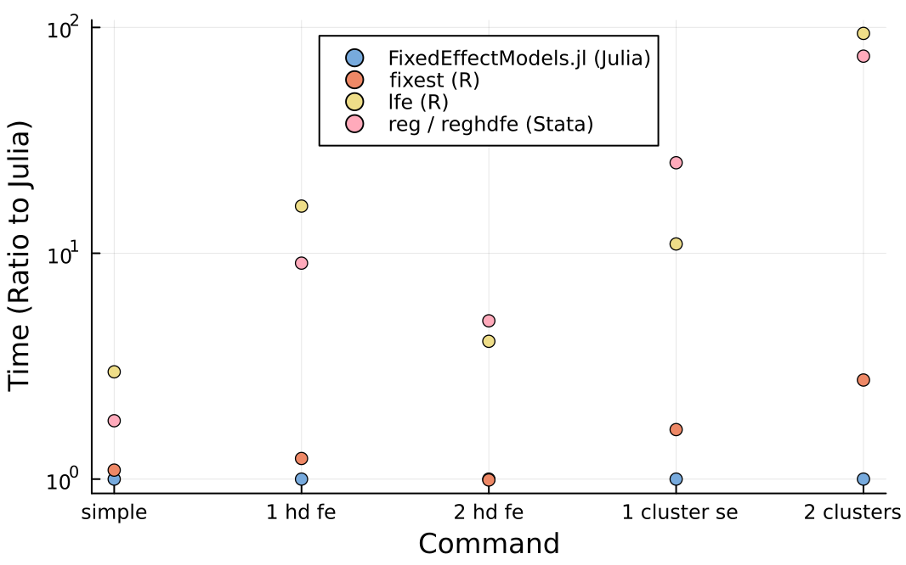

## Motivation and Learning Goals

::: {.callout-important title="Motivation" appearance="simple"}
- Structural estimation approach works best when clear empirical patterns motivate the structural model.
- To find these patterns, we want to run standardized reduced-form analyses quickly.
- Event-study plots, in particular, have become common in applied microeconomics.
:::

::: {.callout-important title="Learning Goals" appearance="simple"}
- Learn how to estimate OLS, IV, and FE models in Julia.
- Learn how to estimate DiD models, including event-study specifications, and RD models by calling R from Julia.
:::

## Generate the Panel Data

- I generate an example dataset for this lecture note.
- This example is inspired by the minimum-wage application in [Callaway and Sant'Anna (2021)](https://doi.org/10.1016/j.jeconom.2020.12.001).
  - The panel contains 1,200 counties observed from 2001 through 2010.
  - Counties first become treated in 2004, 2006, or 2008, or remain untreated.
  - Treatment cohorts are assigned at random.
  - The outcome is the teen employment rate, measured in percentage points.

::: {.callout-note title="Data-generating process" appearance="simple"}
- Let $s_t=t-2001$ denote time since the first sample year.
- The observed control variable is log population:

$$
X_{it}
=
10+0.35\eta_i+0.012s_t+0.08\nu_{it}.
$$

- Without treatment, the teen employment rate is:

$$
Y_{it}(0)
=
55+\alpha_i+1.5(X_{it}-10)
+0.30s_t+0.05s_t^2+1.5\varepsilon_{it}.
$$

- The county effect is $\alpha_i=2.5a_i$.
- The shocks $\eta_i$, $\nu_{it}$, $a_i$, and $\varepsilon_{it}$ are independent standard normal variables.
- Let $G_i$ denote the first treatment year. Never-treated counties have $G_i=0$.
- The treatment effect is:

$$
\tau_{it}
=
\begin{cases}
-1.0-0.5\min(t-G_i,3),
& G_i>0 \text{ and } t\geq G_i,\\
0,
& \text{otherwise}.
\end{cases}
$$

- The observed outcome is:

$$
Y_{it}=Y_{it}(0)+\tau_{it}.
$$
:::

```{julia}
#| label: reduced-form-setup
#| code-fold: true
using DataFrames
using LinearAlgebra
using Plots
using Random
using Statistics

ENV["OMP_NUM_THREADS"] = "1"
```

```{julia}
#| label: generate-panel-data
#| code-fold: true
settings = (
    number_of_counties = 1_200,
    years = 2001:2010,
    treatment_cohorts = [0, 2004, 2006, 2008],
    seed = 2_026_072_501,
)

rng = MersenneTwister(settings.seed)
counties_per_cohort = (
    settings.number_of_counties ÷ length(settings.treatment_cohorts)
)
first_treatment = repeat(
    settings.treatment_cohorts,
    inner = counties_per_cohort,
)
shuffle!(rng, first_treatment)

baseline_log_population = 10 .+ 0.35 .* randn(
    rng,
    settings.number_of_counties,
)
county_effect = 2.5 .* randn(rng, settings.number_of_counties)

rows = NamedTuple[]
for county_id in 1:settings.number_of_counties
    cohort = first_treatment[county_id]
    for year in settings.years
        time_index = year - first(settings.years)
        treated = cohort > 0 && year >= cohort
        event_time = treated ? year - cohort : missing
        true_effect = treated ? -1.0 - 0.5 * min(event_time, 3) : 0.0

        log_population = (
            baseline_log_population[county_id] +
            0.012 * time_index +
            0.08 * randn(rng)
        )
        employment_without_treatment = (
            55.0 +
            county_effect[county_id] +
            1.5 * (log_population - 10.0) +
            0.30 * time_index +
            0.05 * time_index^2 +
            1.5 * randn(rng)
        )

        push!(
            rows,
            (
                county_id = county_id,
                year = year,
                first_treat = cohort,
                treated = treated,
                event_time = event_time,
                log_population = log_population,
                employment_rate = (
                    employment_without_treatment + true_effect
                ),
                true_effect = true_effect,
            ),
        )
    end
end

panel = DataFrame(rows)
first(panel, 8)
```

- Treatment is absorbing: once a county is treated, it remains treated.
- The data-generating process imposes no anticipation.
- The true effect is -1 percentage point in the adoption year, becomes more negative for three years, and then remains constant.

## Descriptive Statistics

```{julia}
#| label: descriptive-statistics
variables = [:employment_rate, :treated, :log_population]

describe(
    panel,
    :mean,
    :std,
    :min,
    :q25,
    :median,
    :q75,
    :max;
    cols = variables,
)
```

## Correlation

- Rows and columns follow the variable order shown above.
- These correlations are descriptive and should not be interpreted as causal effects.

```{julia}
#| label: correlations
correlation_matrix = round.(
    cor(Matrix{Float64}(select(panel, variables))),
    digits = 3,
)
correlation_table = DataFrame(correlation_matrix, variables)
insertcols!(correlation_table, 1, :variable => string.(variables))

correlation_table
```

```{julia}
#| label: fig-correlation-heatmap
#| code-fold: true
#| code-summary: "Show heatmap code"
#| fig-cap: "Correlation heatmap"
variable_labels = replace.(string.(variables), "_" => " ")

correlation_heatmap = heatmap(
    variable_labels,
    variable_labels,
    correlation_matrix;
    color = :RdBu,
    clims = (-1, 1),
    aspect_ratio = 1,
    yflip = true,
    xrotation = 20,
    colorbar_title = "Correlation",
)

correlation_annotations = [
    (
        column - 0.5,
        row - 0.5,
        text(
            string(correlation_matrix[row, column]),
            10,
            abs(correlation_matrix[row, column]) > 0.5 ? :white : :black,
        ),
    )
    for row in axes(correlation_matrix, 1)
    for column in axes(correlation_matrix, 2)
]
annotate!(correlation_heatmap, correlation_annotations)

correlation_heatmap
```

## Linear Regression: OLS, IV, and Fixed Effects (FE)

### FixedEffectModels.jl

- [`FixedEffectModels.jl`](https://github.com/FixedEffects/FixedEffectModels.jl) estimates OLS and instrumental-variable models with high-dimensional fixed effects.
- It covers the same core use case as R's `fixest` and Stata's `reghdfe`.
- The benchmark below compares the reported runtimes of the listed commands, normalized to FixedEffectModels.jl.

{width=82% fig-align="center"}

*Source: [FixedEffectModels.jl benchmark by Matthieu Gomez](http://www.matthieugomez.com/files/fixedeffectmodels_benchmark.png).*

- A general formula with multiple endogenous regressors, instruments, and fixed effects is:

```julia
@formula(
    y ~
    x_exogenous +
    (x_endogenous_1 + x_endogenous_2 ~ instrument_1 + instrument_2) +
    fe(unit_id) +
    fe(time_id)
)
```

- `y` is the outcome variable.
- `x_exogenous` is an exogenous regressor in the coefficient part of the formula.
- The left side of the inner `~` lists the endogenous regressors.
- The right side of the inner `~` lists the excluded instruments. The model needs at least as many instruments as endogenous regressors.
- `fe(unit_id)` and `fe(time_id)` absorb unit and time fixed effects.
- Without the inner `(endogenous ~ instruments)` term, `reg` estimates OLS with the specified fixed effects.
- The example below uses the panel generated above and estimates an OLS model with county and year fixed effects.

```{julia}
#| label: ols-with-fixed-effects
#| html-table-processing: none
using FixedEffectModels
using RegressionTables

panel.treated_numeric = Float64.(panel.treated)

fe_formula = @formula(
    employment_rate ~
    treated_numeric +
    log_population +
    fe(county_id) +
    fe(year)
)
fe_model = reg(
    panel,
    fe_formula,
    Vcov.cluster(:county_id),
)

regtable(
    fe_model;
    render = HtmlTable(),
    labels = Dict(
        "treated_numeric" => "Treated",
        "log_population" => "Log population",
    ),
    print_clusters = true,
)
```

#### Standard Errors

- Omit the third argument of `reg`, or use `Vcov.simple()`, for conventional homoskedastic standard errors.
- Use `Vcov.robust()` for HC1 heteroskedasticity-robust standard errors.
- Use `Vcov.cluster(:county_id)` for one-way clustering by county.
- Use `Vcov.cluster(:county_id, :year)` for two-way clustering by county and year.

## Calling R from Julia with RCall.jl

- `RCall.jl` starts an R session from Julia.
- `R"..."` runs one R expression, while `R"""..."""` runs multiple lines of R code.
- `@rput` copies a Julia variable to R.
- `@rget` copies an R variable to Julia.
- `rcopy` converts an R object to a Julia value.
- R packages must be installed in the R library used by `RCall.jl`.

```{julia}
#| label: run-r-with-rcall
using RCall

R"""
r_values <- c(1, 2, 3, 4)
r_mean <- mean(r_values)
""";

r_mean_with_rcopy = rcopy(R"r_mean")
@rget r_mean

(
    with_rcopy = r_mean_with_rcopy,
    with_rget = r_mean,
)
```

## Difference-in-Differences

- The R package [`did`](https://bcallaway11.github.io/did/) estimates group-time average treatment effects.
- The example sends the Julia panel to R and performs the entire event-study analysis with `did`.

```{julia}
#| label: prepare-did-data
did_data = select(
    panel,
    :county_id,
    :year,
    :first_treat,
    :log_population,
    :employment_rate,
)

did_available = rcopy(R"requireNamespace('did', quietly = TRUE)")
did_available || error("R package 'did' is required.")

did_figure_path = joinpath(
    "assets",
    "reduced_form_analysis",
    "did-event-study.png",
)

@rput did_data did_figure_path
```

::: {.callout-warning title="Run `did` serially through RCall"}
- `RCall.jl` embeds R inside the Julia process.
- In the tested macOS setup, multithreaded `data.table` caused an OpenMP conflict and terminated the process after estimation.
- This example therefore uses `data.table::setDTthreads(1L)` and `cores = 1`.
- If bootstrap inference is enabled for a larger job, use independent `Rscript` processes rather than forking from inside RCall.
:::

```{julia}
#| label: estimate-and-plot-did-in-r
R"""
library(did)
library(ggplot2)

data.table::setDTthreads(1L)
panel_data <- as.data.frame(did_data)

att_group_time <- did::att_gt(
    yname = "employment_rate",
    tname = "year",
    idname = "county_id",
    gname = "first_treat",
    xformla = ~ log_population,
    data = panel_data,
    panel = TRUE,
    control_group = "nevertreated",
    anticipation = 0,
    est_method = "dr",
    base_period = "universal",
    bstrap = FALSE,
    cband = FALSE,
    cores = 1,
    print_details = FALSE
)

event_study <- did::aggte(
    att_group_time,
    type = "dynamic",
    min_e = -3,
    max_e = 4,
    na.rm = TRUE
)

event_study_plot <- did::ggdid(
    event_study,
    xlab = "Event time",
    ylab = "Effect on the employment rate",
    title = ""
)

invisible(
    ggplot2::ggsave(
        filename = did_figure_path,
        plot = event_study_plot,
        width = 7,
        height = 4.5,
        dpi = 160,
        bg = "white"
    )
)
""";
```

```{julia}
#| label: collect-did-results
#| code-fold: true
R"""
critical_value <- stats::qnorm(0.975)

did_results <- data.frame(
    "Event time" = event_study$egt,
    "Estimate" = round(event_study$att.egt, 3),
    "Standard error" = round(event_study$se.egt, 3),
    "CI lower" = round(
        event_study$att.egt - critical_value * event_study$se.egt,
        3
    ),
    "CI upper" = round(
        event_study$att.egt + critical_value * event_study$se.egt,
        3
    ),
    check.names = FALSE
)
""";

@rget did_results
did_results
```

{width=75% fig-align="center"}

- `att_gt` estimates group-time average treatment effects.
- `aggte(..., type = "dynamic")` aggregates them by event time.
- `ggdid` creates the event-study figure in R.
- This example disables the bootstrap and simultaneous confidence bands to keep the render fast.

## Regression Discontinuity

- The example uses a sharp RD design with a cutoff at zero.
- The running variable is $X_i\sim U[-2,2]$.
- Treatment is $D_i=\mathbf{1}\{X_i\geq0\}$.
- The outcome is:

$$
Y_i=2+0.5X_i+1.5D_i+\varepsilon_i,
\qquad
\varepsilon_i\sim N(0,1).
$$

- The true discontinuity at the cutoff is $1.5$.

```{julia}
#| label: generate-rdd-data
rdd_rng = MersenneTwister(2_026_072_502)

rdd_data = DataFrame(
    running_variable = 4 .* rand(rdd_rng, 2_000) .- 2,
)

rdd_data.error = randn(rdd_rng, nrow(rdd_data))
rdd_data.treated = rdd_data.running_variable .>= 0

rdd_data.outcome = (
    2 .+
    0.5 .* rdd_data.running_variable .+
    1.5 .* rdd_data.treated .+
    rdd_data.error
)

select!(rdd_data, :running_variable, :outcome)

rdd_available = rcopy(
    R"requireNamespace('rdrobust', quietly = TRUE)"
)
rdd_available || error("R package 'rdrobust' is required.")

rdd_figure_path = joinpath(
    "assets",
    "reduced_form_analysis",
    "rdd-plot.png",
)

@rput rdd_data rdd_figure_path
first(rdd_data, 5)
```

```{julia}
#| label: estimate-and-plot-rdd-in-r
R"""
library(rdrobust)
library(ggplot2)

rd_data <- as.data.frame(rdd_data)

rd_result <- rdrobust::rdrobust(
    y = rd_data$outcome,
    x = rd_data$running_variable,
    c = 0,
    p = 1
)

rd_plot_result <- rdrobust::rdplot(
    y = rd_data$outcome,
    x = rd_data$running_variable,
    c = 0,
    p = 1,
    hide = TRUE,
    x.label = "Running variable",
    y.label = "Outcome",
    title = ""
)

invisible(
    ggplot2::ggsave(
        filename = rdd_figure_path,
        plot = rd_plot_result$rdplot,
        width = 7,
        height = 4.5,
        dpi = 160,
        bg = "white"
    )
)
""";
```

```{julia}
#| label: collect-rdd-results
#| code-fold: true
R"""
rdd_results <- data.frame(
    "Method" = rownames(rd_result$coef),
    "Estimate" = round(as.numeric(rd_result$coef), 3),
    "Standard error" = round(as.numeric(rd_result$se), 3),
    "p-value" = format.pval(
        as.numeric(rd_result$pv),
        digits = 3,
        eps = 0.001
    ),
    "CI lower" = round(rd_result$ci[, 1], 3),
    "CI upper" = round(rd_result$ci[, 2], 3),
    check.names = FALSE,
    row.names = NULL
)
""";

@rget rdd_results
rdd_results
```

```{julia}
#| label: collect-rdd-diagnostics
#| code-fold: true
R"""
rdd_diagnostics <- data.frame(
    "Side" = c("Left of cutoff", "Right of cutoff"),
    "Estimation bandwidth (h)" = round(rd_result$bws["h", ], 3),
    "Bias bandwidth (b)" = round(rd_result$bws["b", ], 3),
    "Effective observations" = as.integer(rd_result$N_h),
    check.names = FALSE,
    row.names = NULL
)
""";

@rget rdd_diagnostics
rdd_diagnostics
```

{width=75% fig-align="center"}

- `rdrobust` estimates the discontinuity with local-polynomial methods and robust inference.
- The conventional row reports the unadjusted local-polynomial estimate and standard error.
- The bias-corrected row adjusts the point estimate for estimated bias.
- The robust row reports the bias-corrected estimate with a robust standard error and confidence interval.
- The diagnostics table reports the bandwidths and effective observations used on each side of the cutoff.
- `rdplot` provides an exploratory binned plot of the conditional mean around the cutoff.
