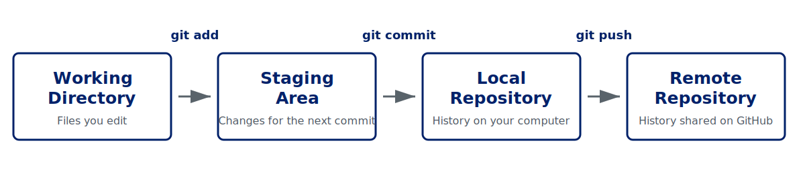
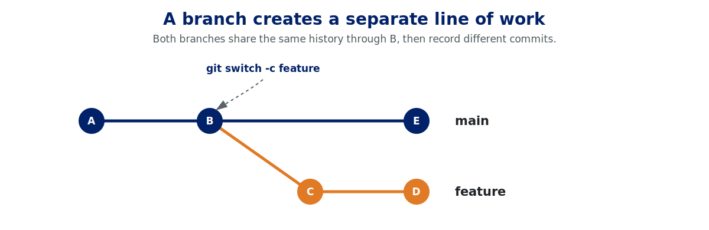
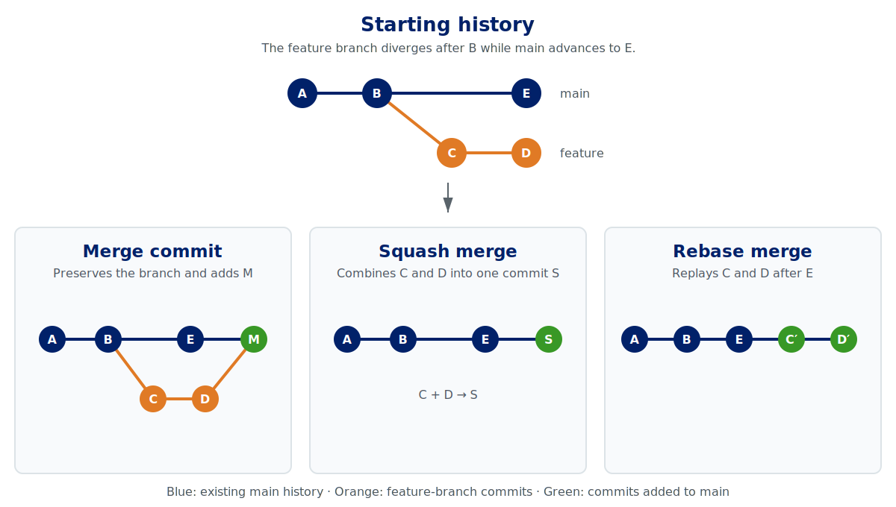

## Motivation and Learning Goals

### Motivation

- Coding without version control is a nightmare.
  - Where is the latest code?
  - Is the experimental functionality included, or not?
  - You may end up creating many versions of the same file:
    - *estimation1.jl*
    - *estimation2.jl*
    - *estimation_submission.jl*
    - *estimation_final.jl*
  - You will spend too much time dealing with these inefficiencies.
- AI can write code quickly, but we still need to review what changed and when.
- We want to use the same code in different environments, such as the Duke computing cluster.

### Learning Goals

- Understand what Git can do and how to use it effectively.
- Learn about tools that improve the Git experience.

::: {.callout-note title="A Note on Git Commands"}

- I mention Git commands only to explain the underlying workflow. You do not need to memorize them.
- In practice, you can use Git through Lazygit or ask AI to run the commands.
:::

## Git and GitHub

### What Is Git?

- Git is an open-source version control system.
- Git is widely used to develop and maintain software.

### What Is GitHub?

- GitHub is a platform that hosts Git repositories.
- Other hosting platforms are available, but GitHub is one of the most widely used.

## Setup

1. Install Git.
2. Create a GitHub account.
3. Install the GitHub CLI, **gh**.
4. Configure your Git identity.
5. Authenticate with GitHub.

## Minimum Workflow

{width=96% fig-align="center"}

- Assume that you have a Git environment and have made some edits.

1. **git add:** Choose the files you want to save.
2. **git commit:** Save the files with a message.
3. **git push:** Upload the files to a remote repository.

- These are the main Git commands you will use. Other commands support this workflow.

## Git Commands We Should Know

### Repository Setup

- **git clone**
  - Create a local copy of an existing repository, including its history.
- **git init**
  - Create a new Git repository in the current directory.
  - Usually, however, you first create a GitHub repository and clone it.
- **git push**
  - Send local commits to a remote repository.
- **git pull**
  - Fetch changes from a remote repository and integrate them into the current branch.
- **.gitignore**
  - List files and folders that Git should not track.

For example, the following patterns ignore the *data* folder and all PDF files:

- data/
- *.pdf

### Recording Changes

- **git add**
  - Stage selected changes for the next commit.
- **git commit**
  - Record the staged changes as a snapshot in the local repository.

::: {.callout-tip title="Committing with AI"}
- You can simply say, “Commit the changes.”
- If you made extensive edits, give AI a more specific instruction:
  - “Commit the changes. They include many edits, so split them into appropriate units and use suitable commit messages.”
- You can create a skill if you prefer this workflow.
:::

### Inspecting Changes

- **git status**
  - Show which files are untracked, modified, or staged.
- **git diff**
  - Show changes that have not yet been staged.
- **git diff --staged**
  - Show changes that have already been staged.
- You can also ask Codex or Claude Cowork to display and explain these differences.

### Inspecting History and Recovering Changes

- **git log**
  - View the commit history.
- **git show**
  - Inspect the changes recorded in a specific commit.
- **git restore**
  - Discard uncommitted changes, or unstage changes when used with **--staged**.
- **git revert**
  - Reverse an earlier commit by creating a new commit.

::: {.callout-warning title="Before Using git restore"}
Check **git status** and **git diff** first. Discarded uncommitted changes may be difficult to recover.
:::

### Tags and Versions

- A tag gives a readable name to a specific commit.
- Tags are commonly used to mark releases, submissions, and other important versions.

::: {.callout-tip title="Using Tags"}
- A repository may contain many commits, making important milestones difficult to find.
- Use tags to mark versions that you may want to identify or return to later.
:::

### Branching and Merging

- A branch is a separate line of work within the same repository.
- It allows you to develop and review a change without immediately modifying the main branch.

{width=90% fig-align="center"}

- **git switch**
  - Switch between existing branches, or create a new branch with **-c**.
  - Older tutorials often use **git checkout** for the same task.
- **git worktree**
  - Check out another branch in a separate working directory that shares the same repository and history.

::: {.callout-tip title="Using Worktrees with AI"}
- When you ask multiple AI agents to write code simultaneously, worktrees are useful.
- For example, suppose you want AI to make a change:
  - Write down the desired change. A GitHub issue, explained below, is usually the best place.
  - Ask AI to create a worktree and work on the issue.
  - Because the worktree provides a separate working directory, you can continue your own work.
  - If you do not like the result, you can remove the worktree and discard its branch.
:::

#### Merge Strategies

- All three strategies integrate a feature branch into the main branch, but they preserve the history differently.

{width=96% fig-align="center"}

- **Merge commit:** Preserve the branch structure and its original commits, then add a separate merge commit.
- **Squash merge:** Combine all commits from the feature branch into one new commit on the main branch.
- **Rebase merge:** Replay the feature-branch commits after the latest commit on the main branch, creating a linear history without a merge commit.

::: {.callout-important title="Course Default: Squash Merge"}
- Use squash merge by default in this course.
- It keeps the main-branch history concise by combining a branch's incremental commits into one completed change.
:::

## GitHub

### GitHub CLI

- **gh** is a command-line tool for GitHub.
- It can create and inspect repositories, issues, and pull requests.
- AI can combine Git history with information from **gh** to answer questions or perform tasks such as:
  - Which commit introduced this change, and who made it?
  - Write an issue about XXX.

### Pull Requests

- A pull request asks others to review changes in a branch before merging them into another branch.
- Additional commits pushed to the branch automatically appear in the same pull request.

### GitHub Issues

- When a repository grows, you need a task management tool that is integrated with Git.
  - Gentzkow and Shapiro: email is not a task management system!
- GitHub Issues provide sufficient functionality for this purpose.
- Examples:
  - Investigate why the matching rate is low when merging data.
  - Fix an issue in the estimation process.
- You can create an issue on the GitHub website or through the **gh** CLI.

::: {.callout-tip title="When to Commit, Push, Branch, or Open an Issue"}
- Common questions:
  - When should I commit and push?
  - When should I create a branch or an issue?
- The answers depend on personal preference. I use the following rules for my personal repositories:
  - I commit when a task is done.
  - I push when the workday is finished.
  - I create a branch unless the task is sufficiently small and expected to be easily solved.
  - I create an issue if I think the issue is critical or it affects the entire repo.  
- For a coauthored project, I always create branches and issues so that my code changes are transparent.
:::

## Relevant Tools

### Lazygit

- Git commands are difficult to remember.
- Lazygit allows us to use Git through a simple user interface.
- I will show you the interface.
- Personally, I mostly use AI to run Git commands, but I still use Lazygit to commit manually when an edit is critical.

### ghq

- When you have multiple Git repositories, you may wonder, “Where is my repository?”
- ghq organizes their locations in one place.
- You can call ghq with a shortcut key and find the relevant folder.
- I will show how to use it.

## Example Case 1: You Find a Small Error

1. Fix the error.
2. Commit and push the change.

## Example Case 2: You Find a Critical Error

1. Discuss the error and its solution with AI.
2. Ask AI to write a GitHub issue.
3. If you are satisfied with the proposed solution, create a branch and ask AI, “Fix issue No. X.”
   - If not, continue the discussion and ask AI to revise the issue.
4. Ask AI to open a pull request and review the proposed changes.
5. After confirming that there are no problems, merge the pull request into the main branch.

## Example Case 3: You Are Writing a Draft but Want to Conduct Exploratory Analysis

- Discuss the direction of the analysis with AI and ask it to write a GitHub issue.
- Ask AI, “Create a worktree and work on issue No. X. Report the results in the issue when you finish.”
- You can continue working on your draft.
- Review the results on GitHub after AI finishes the task.
- If you are satisfied with the results, merge the changes. If not, delete the worktree.

## References

- [Slides on Git](https://luispfonseca.com/files/slides_git.pdf)

- [Video on Git](https://www.youtube.com/watch?v=U686qx0IubM)

- [*Code and Data for the Social Sciences: A Practitioner’s Guide*](https://web.stanford.edu/~gentzkow/research/CodeAndData.pdf)
